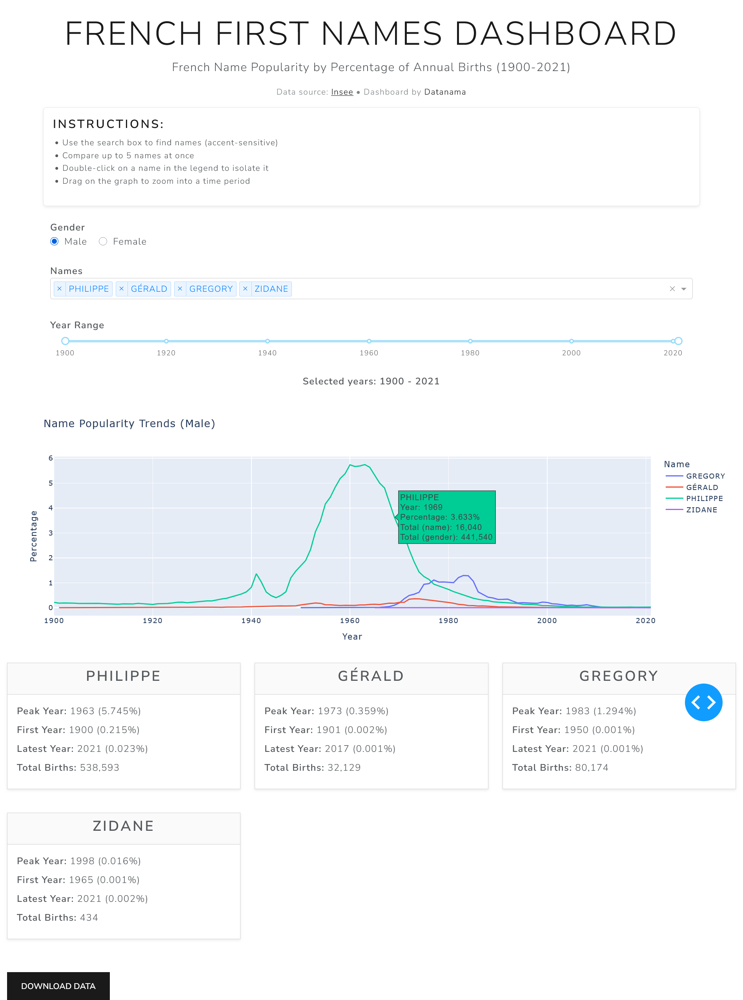

# French First Names Dashboard (% Per Year)
[](https://opensource.org/licenses/MIT)

An interactive dashboard to visualize French first names popularity as a **percentage of annual births** by gender (1900–2021).



---

## Key Design Philosophy: User-Centric vs Technical Approach

### Why Percentage (% of births) instead of INSEE's "per 10,000" format?

This dashboard intentionally uses **percentage with 3-decimal precision** rather than INSEE's "per 10,000" format to prioritize **user experience and accessibility** for a general audience.

#### Statistical Accuracy: Identical Precision
Both metrics are **mathematically equivalent** and provide identical accuracy:
- **3-decimal percentage** (0.016%) = **per 10,000 with 1 decimal** (1.6 per 10,000)
- All trend analysis, pattern recognition, and comparative insights remain identical
- No loss of statistical precision or analytical capability

#### Percentage Advantages (Our Choice)
- **Universal familiarity**: Percentages are intuitive for general audiences worldwide
- **Mental math ease**: Base-100 calculations are natural for most users
- **Cleaner display**: "1.2%" is more compact than "120 per 10,000"
- **Accessibility first**: No need to translate technical demographic rates

#### When "Per 10,000" Excels
- **Extremely rare names**: For names <0.01%, shows more prominent digits (0.4 vs 0.004%)
- **Academic standards**: Aligns with professional demographic conventions
- **Institutional consistency**: Matches INSEE's technical presentation

#### **Strategic Decision**
As a **public-facing portfolio project**, this dashboard prioritizes **user experience over technical and academic conventions**.

---

## What Makes This Dashboard Unique

### **Enhanced User Experience vs INSEE Tool**
INSEE's existing tool has several limitations this dashboard addresses:
- **Poor visual hierarchy**: Names displayed as cramped lists spanning multiple lines
- **Color confusion**: Some names share colors, making differentiation difficult
- **Limited interactivity**: No zoom functionality or data export capabilities

### **Our Improvements**
- **Clean interface design**: Professional responsive layout with Bootstrap
- **Interactive controls**: Gender filtering, multi-name comparison (up to 5), year range sliders
- **Enhanced analytics**: Statistical insights with peak years, first appearances, and totals
- **Export functionality**: CSV data download for further analysis
- **Mobile optimization**: Fully responsive across all devices

---

## Features

- **Interactive Visualization:** Compare up to 5 names at a time with dynamic line charts
- **Advanced Filtering:** By gender, name selection, and custom year ranges
- **Statistical Insights:**  
  - **Peak Year:** When the name reached maximum popularity (% of births)
  - **First Year:** First recorded appearance in the dataset (with percentage)
  - **Latest Year:** Most recent data point (% of births)
  - **Total Births:** Cumulative births for each name and gender
- **Responsive Design:** Optimized for desktop, tablet, and mobile devices
- **Data Export:** Download filtered results as CSV files
- **High Precision:** 3-decimal accuracy captures trends in both common and rare names

---

## Potential Future Development (Advanced Features)

These features could be implemented by community contributors or in separate projects:

- **Pattern Recognition & Projections**: Machine learning models to predict future name popularity trends
- **Regional Analysis**: Integration with regional French data for geographic popularity mapping
- **Comparative Analysis Tools**: Side-by-side name comparison with statistical correlation analysis
- **Historical Context Integration**: Overlay major historical events that influenced naming trends

---

## Tech Stack

- **Dashboard Framework:** Dash & Plotly
- **Styling:** Bootstrap (dash-bootstrap-components)
- **Data Processing:** Python & Pandas (with LRU caching for performance)
- **Deployment Ready:** Compatible with Heroku, Render, Fly.io, and similar platforms

---

## Quick Start

```
# Clone the repository
git clone https://github.com/datanama-m/french-names-analytics.git
cd french-names-analytics

# Set up virtual environment
python -m venv .venv
source .venv/bin/activate # On Windows: .venv\Scripts\activate

# Install dependencies
pip install -r requirements.txt

# Run the dashboard
python app.py

# Open in browser: http://127.0.0.1:8050
```

---

## Usage Guide

1. **Select Gender** using the radio button controls
2. **Choose Names** from the searchable dropdown (up to 5 for comparison)
3. **Set Year Range** with the interactive slider
4. **Analyze Trends** in the dynamic chart with hover details and summary cards
5. **Export Data** as CSV for offline analysis or further research

---

## Data Source

- **INSEE** (French National Institute of Statistics) 
- **Dataset:** [National first names by year and gender (1900-2021)](https://www.insee.fr/fr/statistiques/2540004#consulter)
- **Coverage:** Complete French birth records with annual granularity
- **Quality:** Official government statistics with comprehensive validation

---

## Portfolio Context

This project demonstrates:
- **User experience prioritization** over technical convention
- **Full-stack data science capabilities** from ETL to interactive visualization  
- **Performance optimization** with caching and responsive design
- **Professional code organization** with modular, maintainable architecture
- **Public deployment readiness** with proper documentation and testing

---

## Contributing

Contributions, suggestions, and discussions are welcome!
- **Issues:** Bug reports, feature requests, or questions
- **Pull Requests:** Code improvements, new features, or documentation updates
- **Feedback:** User experience insights or technical suggestions

---

## About

Created by a data analyst passionate about making complex datasets accessible through thoughtful design and interactive storytelling.

**Contact:** [maxime@datanama.net](mailto:maxime@datanama.net)  
**Focus:** Data analytics, digital marketing, and user-centric data visualization

---

## License

MIT License – see [LICENSE](LICENSE) for details.

---

## Acknowledgments

- INSEE for providing comprehensive French demographic datasets
- Dash/Plotly community for excellent documentation and framework
- Bootstrap team for responsive UI components that enhance accessibility
